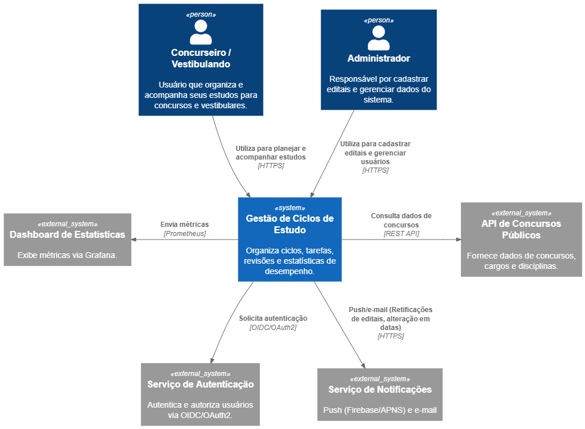

# 🧭 Diagrama de Contexto — Sistema de Gestão de Ciclos de Estudo (Modelo C4 - Nível 1)

## 1. Visão Geral

O sistema de **Gestão de Ciclos de Estudo** é uma aplicação voltada para candidatos de concursos públicos e vestibulares.  
Seu principal objetivo é **organizar, acompanhar e otimizar o ciclo de estudos**, considerando disciplinas, pesos, estatísticas de desempenho e progresso ao longo do tempo.

O **Diagrama de Contexto (C4 - Nível 1)** descreve as principais **entidades externas**, o **sistema como uma caixa-preta**, e as **interações** de alto nível entre eles.

---

## 2. Elementos Principais

| Tipo                 | Nome / Papel                                | Descrição                                                                                                |
| -------------------- | ------------------------------------------- | -------------------------------------------------------------------------------------------------------- |
| **Pessoa (Usuário)** | **Concurseiro ou Vestibulando**             | Usuário principal do sistema, cria ciclos de estudo, define disciplinas, acompanha progresso e revisões. |
| **Sistema**          | **Gestão de Ciclos de Estudo**              | Sistema central responsável por gerenciar ciclos, disciplinas, tarefas, revisões e estatísticas.         |
| **Sistema Externo**  | **API de Concursos Públicos**               | Fonte externa de dados sobre concursos, cargos, disciplinas e editais.                                   |
| **Sistema Externo**  | **Serviço de Autenticação (OIDC / OAuth2)** | Sistema de login seguro, utilizado para autenticar e autorizar o acesso do usuário.                      |
| **Sistema Externo**  | **Dashboard de Estatísticas (Grafana)**     | Sistema de visualização conectado a métricas e logs do ciclo de estudo.                                  |

---

## 3. Interações de Alto Nível

1. O **Usuário (Concurseiro)** acessa o sistema via navegador ou aplicativo móvel.
2. O sistema autentica o usuário via **OIDC/OAuth2**.
3. O usuário cria e gerencia seus **ciclos de estudo**, **disciplinas**, e **tarefas**.
4. O sistema consulta **dados de concursos** via **API de Concursos Públicos**.
5. Estatísticas de desempenho são enviadas para o **Dashboard (Grafana)**.

---

## 4. Diagrama

