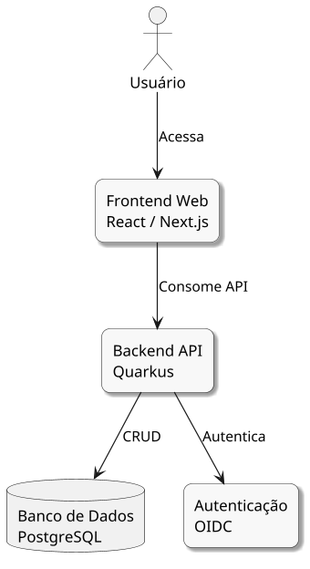

# 📦 Diagrama de Container — Sistema de Gestão de Ciclos de Estudo (Modelo C4 - Nível 2)

## 1. Visão Geral

O **Diagrama de Container (C4 - Nível 2)** decompõe o sistema em seus principais **containers** (aplicações ou serviços que executam separadamente). Cada container representa uma unidade de implantação com responsabilidades específicas dentro da arquitetura.

Este diagrama mostra como o **Frontend Web**, **Backend API**, **Banco de Dados** e **Serviço de Autenticação** interagem entre si para fornecer as funcionalidades do sistema de gestão de ciclos de estudo.

---

## 2. Containers Principais

| Container          | Tecnologia      | Descrição                                                           | Responsabilidades                                                                                                                                                          |
| ------------------ | --------------- | ------------------------------------------------------------------- | -------------------------------------------------------------------------------------------------------------------------------------------------------------------------- |
| **Frontend Web**   | React / Next.js | Interface web responsiva acessada pelo usuário através do navegador | • Apresentar interface interativa • Gerenciar estado da aplicação • Comunicar com Backend API • Exibir dashboards e gráficos                                      |
| **Backend API**    | Quarkus (Java)  | API RESTful que processa regras de negócio e orquestra operações    | • Implementar regras de negócio • Gerenciar ciclos de estudo • Processar cálculos de métricas • Validar e processar requisições • Comunicar com banco de dados |
| **Banco de Dados** | PostgreSQL      | Banco de dados relacional para persistência de dados                | • Armazenar usuários e perfis • Persistir editais e disciplinas • Guardar ciclos de estudo • Registrar sessões de estudo • Manter estatísticas                 |
| **Autenticação**   | OIDC / OAuth2   | Serviço de autenticação e autorização de usuários                   | • Autenticar usuários • Gerenciar tokens de acesso • Controlar permissões • Garantir segurança de acesso                                                          |

---

## 3. Fluxo de Interações

### 3.1 Autenticação do Usuário

1. **Usuário** acessa o **Frontend Web** através do navegador
2. **Frontend Web** redireciona para **Autenticação (OIDC)**
3. **Autenticação** valida credenciais e retorna token de acesso
4. **Frontend Web** armazena token e permite acesso ao sistema

### 3.2 Operações CRUD

1. **Usuário** interage com **Frontend Web** (criar ciclo, registrar sessão, etc.)
2. **Frontend Web** envia requisição HTTP para **Backend API**
3. **Backend API** autentica requisição com **Autenticação**
4. **Backend API** processa regras de negócio
5. **Backend API** realiza operações CRUD no **Banco de Dados (PostgreSQL)**
6. **Banco de Dados** retorna resultado
7. **Backend API** processa resposta e retorna ao **Frontend Web**
8. **Frontend Web** atualiza interface para o **Usuário**

### 3.3 Visualização de Métricas

1. **Usuário** solicita dashboard de estatísticas no **Frontend Web**
2. **Frontend Web** requisita dados ao **Backend API**
3. **Backend API** consulta e agrega dados do **Banco de Dados**
4. **Backend API** calcula métricas (total de horas, progresso por disciplina, etc.)
5. **Backend API** retorna dados formatados
6. **Frontend Web** renderiza gráficos e visualizações

---

## 4. Tecnologias e Protocolos

| Camada           | Tecnologia                               | Protocolo/Padrão  |
| ---------------- | ---------------------------------------- | ----------------- |
| **Apresentação** | React / Next.js, HTML5, CSS3, JavaScript | HTTPS             |
| **API**          | Quarkus, JAX-RS, RESTEasy                | REST, JSON, HTTPS |
| **Autenticação** | OpenID Connect (OIDC), OAuth2            | HTTPS, JWT        |
| **Persistência** | PostgreSQL, JDBC                         | TCP/IP, SQL       |

---

## 5. Requisitos Atendidos

### Requisitos Funcionais

- **RF01**: Autenticação implementada via OIDC
- **RF02-RF10**: Operações CRUD gerenciadas pelo Backend API
- **RF06**: Cálculos de métricas processados no Backend
- **RF07**: Visualizações renderizadas no Frontend Web

### Requisitos Não Funcionais

- **RNF01**: Autenticação segura com OIDC/OAuth2
- **RNF02**: Frontend responsivo com React/Next.js
- **RNF03**: Performance otimizada com Quarkus
- **RNF04**: PostgreSQL como banco relacional
- **RNF05**: API RESTful com Quarkus/JAX-RS
- **RNF06**: Framework moderno (React)
- **RNF07**: Integridade referencial no PostgreSQL
- **RNF08**: Logs centralizados no Backend API

---

## 6. Diagrama PlantUML

O diagrama visual correspondente está disponível em `diagrama_container.puml` e pode ser renderizado utilizando ferramentas compatíveis com PlantUML.

---

## 7. Considerações de Arquitetura

### 7.1 Separação de Responsabilidades

- **Frontend**: Focado em experiência do usuário e apresentação
- **Backend**: Concentra lógica de negócio e validações
- **Banco de Dados**: Persistência confiável e transacional
- **Autenticação**: Segurança isolada e especializada

### 7.2 Escalabilidade

- Frontend pode ser servido via CDN
- Backend pode escalar horizontalmente (múltiplas instâncias)
- Banco de dados pode utilizar réplicas para leitura
- Autenticação pode ser centralizada para múltiplos sistemas

### 7.3 Manutenibilidade

- Cada container pode ser desenvolvido e implantado independentemente
- Tecnologias específicas para cada responsabilidade
- Contratos bem definidos através de APIs REST
- Versionamento de API para compatibilidade

---

## 8. Próximos Passos

O próximo nível de detalhamento (C4 - Nível 3) focará no **Diagrama de Componentes**, detalhando a estrutura interna de cada container, especialmente do **Backend API**.
